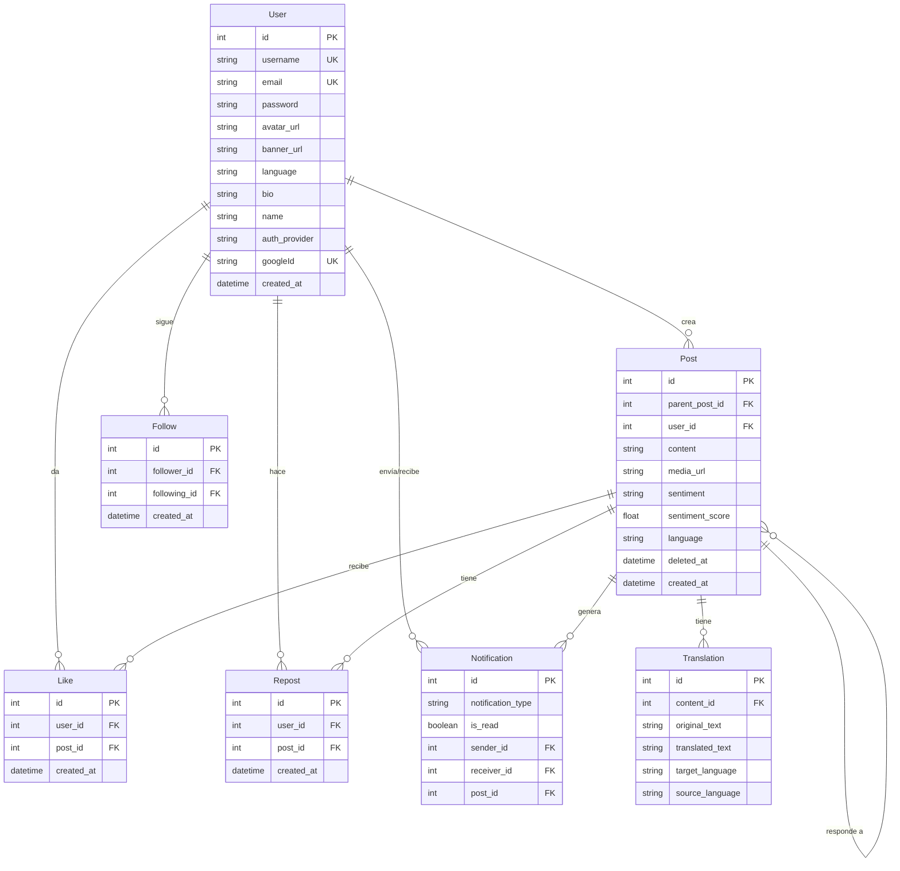

<div align="center">

# PingUp

### Red social multifuncional con análisis de sentimiento y traducción en tiempo real

[](https://www.typescriptlang.org/)
[](https://react.dev/)
[](https://expressjs.com/)
[](https://www.postgresql.org/)
[](https://www.prisma.io/)
[](https://tailwindcss.com/)
</div>

---

## Sobre el proyecto

**PingUp** es una red social desarrollada como proyecto de fin de grado que combina funcionalidades clásicas de redes sociales con capacidades de **análisis de sentimiento** y **traducción automática** integradas mediante la API de Google Cloud. El proyecto demuestra capacidad técnica full-stack, desde el diseño de base de datos relational hasta la implementación de IA para procesamiento de lenguaje natural.

<!-- IMAGE PLACEHOLDER: Captura de pantalla de la feed principal mostrando posts con etiquetas de sentimiento (positivo, neutral, negativo) y botón de traducir. Aspecto oscuro con la interfaz completa visible. -->


---

## Funcionalidades principales

### Autenticación
- Registro e inicio de sesión con email y contraseña (bcrypt + JWT)
- Autenticación OAuth con Google (Passport.js Google Strategy)
- Middleware de rate limiting para prevenir abuso en login y creación de posts

<!-- IMAGE PLACEHOLDER: Captura de pantalla del modal de login mostrando los campos de email/contraseña y el botón de "Continuar con Google" -->


### Sistema de posts
- Creación de posts con contenido de texto (máx. 280 caracteres) y adjuntos multimedia (imágenes/videos)
- Subida de archivos a Cloudinary con validación de tipo y tamaño
- Respuestas a posts (sistema de hilos simple)
- Eliminación lógica de posts (soft delete)
- Paginación basada en cursor para carga infinita

### Interacción social
- Sistema de seguir/dejar de seguir usuarios con toggle instantáneo
- Likes con actualización optimista en la UI
- Reposts
- Notificaciones para likes, follows y reposts (todavía no son en tiempo real)
- Sección "A quién seguir" con usuarios sugeridos

### Análisis de sentimiento (Google Cloud NLP)
- Cada post de texto es analizado automáticamente al crearse
- Clasificación en tres categorías: **positivo**, **neutral**, **negativo**
- Filtro de posts por sentimiento en la feed principal, el usuario puede elegir dicho filtros
- Fallback automático: si el idioma del post no es soportado por la API de NLP, se traduce al inglés para su análisis

### Traducción automática (Google Cloud Translate)
- Traducción de posts a cualquier idioma soportado
- Cache de traducciones en base de datos para evitar llamadas repetidas a la API
- Detección automática del idioma de origen

### Perfil de usuario
- Página de perfil con avatar, banner, bio y estadísticas (seguidores, seguidores, posts)
- Tabs de posts y respuestas del usuario
- Edición de perfil (nombre, bio, avatar, banner)
- Cambio de idioma de preferencia

### Búsqueda
- Búsqueda de usuarios en tiempo real con debounce (300ms)
- Dropdown de resultados con navegación directa al perfil

<!-- IMAGE PLACEHOLDER: Captura de la barra de búsqueda activa mostrando el dropdown con resultados de usuarios, incluyendo avatar, nombre y @username -->


---

## Arquitectura técnica

### Stack tecnológico

| Capa | Tecnología |
|------|-----------|
| **Frontend** | React 19, TypeScript, Vite 7, Tailwind CSS v4 |
| **Backend** | Express 5, TypeScript, Node.js |
| **Base de datos** | PostgreSQL + Prisma ORM |
| **Autenticación** | JWT (Passport.js) + Google OAuth 2.0 |
| **Almacenamiento** | Cloudinary (imágenes y videos) |
| **IA / NLP** | Google Cloud Natural Language API |
| **Traducción** | Google Cloud Translate API |
| **Estado del cliente** | TanStack React Query + React Context |

### Estructura del proyecto

```
pingup/
├── backend/
│   ├── src/
│   │   ├── config/          # Passport, Cloudinary, credenciales Google
│   │   ├── controllers/     # Lógica de manejo de requests
│   │   ├── middlewares/      # Auth, rate limiting, uploads, validaciones
│   │   ├── queries/         # Capa de acceso a datos (Prisma)
│   │   ├── routes/          # Definición de endpoints
│   │   ├── services/        # Lógica de negocio (NLP, traducción, follows)
│   │   └── validations/     # Validaciones con express-validator
│   └── prisma/
│       └── schema.prisma    # Modelo de base de datos
├── frontend/
│   └── src/
│       ├── assets/          # Iconos SVG e imágenes
│       ├── components/      # Componentes React (navbar, feed, dialogs, user)
│       ├── context/         # AuthContext (React Context)
│       ├── hooks/           # Custom hooks para API y UI
│       ├── layout/          # Layout principal y estructura de página
│       ├── lib/             # Cliente Axios y utilidades
│       ├── pages/           # Páginas (feed, explore, profile, settings)
│       ├── routes/          # Configuración de React Router
│       ├── utils/           # Utilidades (formato de fechas)
│       └── validations/     # Schemas Zod para formularios
└── package.json             # Script raíz con concurrently
```

### Modelo de base de datos



### Flujo de análisis de sentimiento

<!-- IMAGE PLACEHOLDER: Diagrama de flujo mostrando el proceso: Post creado → Detección de idioma → Si soportado: análisis NLP directo → Si no soportado: traducción al inglés → análisis NLP → Etiquetado (positivo/neutral/negativo) → Guardado en BD -->


```
Post creado
    │
    ▼
Detección de idioma (Google Translate)
    │
    ▼
¿Idioma soportado por NLP?
    │
    ├── Sí ──▶ Análisis de sentimiento directo
    │              │
    ▼              ▼
    No ──▶ Traducción al inglés
               │
               ▼
         Análisis de sentimiento
               │
               ▼
    Clasificación: positivo / neutral / negativo
               │
               ▼
    Guardado en el campo sentiment del post
```

---

## API REST

### Autenticación
| Método | Endpoint | Descripción |
|--------|----------|-------------|
| POST | `/signup` | Registro de usuario |
| POST | `/login` | Inicio de sesión |
| GET | `/auth/google` | Iniciar flujo OAuth con Google |
| GET | `/auth/google/callback` | Callback de Google OAuth |

### Posts
| Método | Endpoint | Descripción |
|--------|----------|-------------|
| POST | `/post` | Crear post (con multimedia opcional) |
| GET | `/post` | Obtener posts (paginación por cursor) |
| GET | `/post/:post_id` | Obtener detalle de un post |
| GET | `/posts-user-follows` | Feed personalizada |
| PUT | `/delete/:post_id` | Eliminar post (soft delete) |
| POST | `/like/:post_id` | Toggle like |
| POST | `/repost/:post_id` | Toggle repost |
| POST | `/post/:post_id/translate` | Traducir post a un idioma |

### Usuarios
| Método | Endpoint | Descripción |
|--------|----------|-------------|
| GET | `/me` | Datos del usuario autenticado |
| GET | `/:username` | Perfil de usuario por username |
| GET | `/:username/posts` | Posts de un usuario |
| GET | `/:username/replies` | Respuestas de un usuario |
| GET | `/search?q=` | Buscar usuarios |
| GET | `/suggested-users` | Usuarios sugeridos para seguir |
| POST | `/follow/:followingId` | Toggle seguir/dejar de seguir |
| PATCH | `/updateProfile` | Actualizar perfil |
| PATCH | `/updateLanguage` | Cambiar idioma de preferencia |
| GET | `/notifications` | Obtener notificaciones |

---

## Decisiones técnicas destacadas

- **Paginación por cursor** en lugar de offset para mejor rendimiento en feeds con datos en tiempo real
- **Soft deletes** para posts — los registros nunca se eliminan físicamente, preservando integridad referencial
- **Cache de traducciones** en base de datos para minimizar costos de API de Google Cloud
- **Actualización optimista** en likes, follows y reposts para experiencia fluida sin esperar respuesta del servidor
- **Fallback de sentimiento**: traducción automática al inglés cuando el idioma no es soportado por la API de NLP
- **Rate limiting** para proteger contra abuso de varias peticiones repetitivas desde una misma ip
- **Modales vía URL** (`?modal=compose`) para compartir enlaces directos a acciones específicas

---

## Autor

**Gianni Gabriel** — [GitHub](https://github.com/GianniGabriel-dev)

<!-- IMAGE PLACEHOLDER: Banner o logo del proyecto con el nombre "PingUp" y un tagline como "Social network with real-time sentiment analysis" en estilo moderno y oscuro -->

