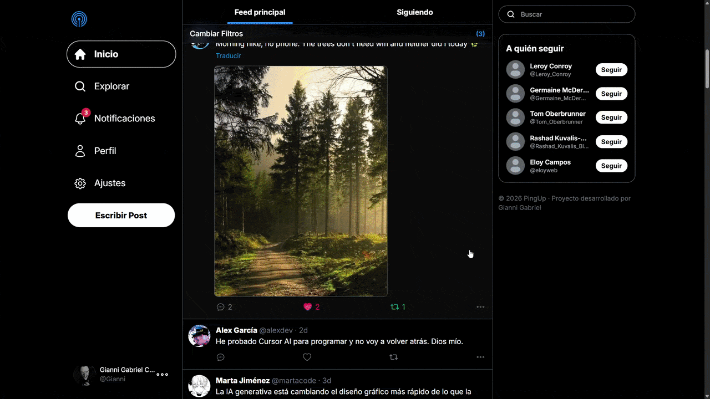
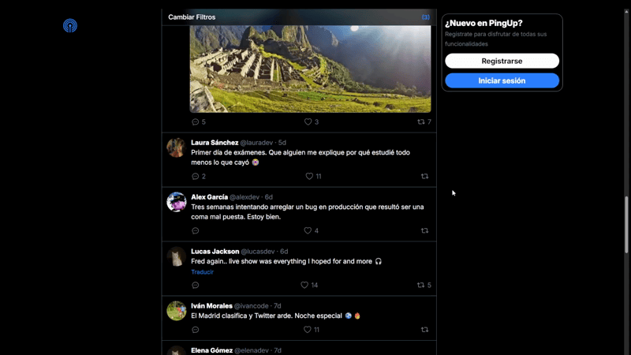
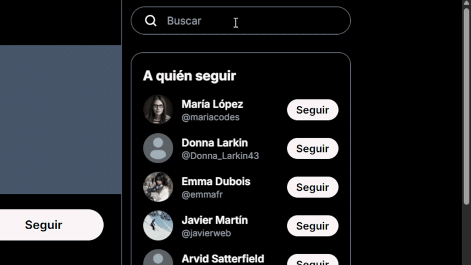
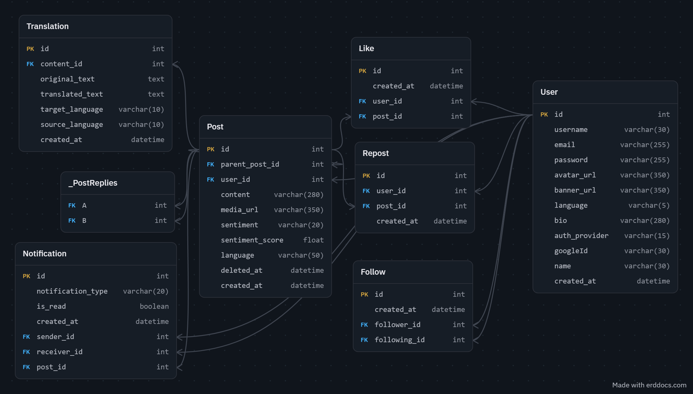

<div align="center">

# PingUp

### Red social multifuncional con análisis de sentimiento y traducción automática

Una plataforma de red social **full-stack** inspirada en Twitter/X, desarrollada con **React, TypeScript, Express y PostgreSQL**, con análisis de sentimiento mediante IA y traducción automática de contenido.

<br>

[](https://www.typescriptlang.org/)
[](https://react.dev/)
[](https://expressjs.com/)
[](https://www.postgresql.org/)
[](https://www.prisma.io/)
[](https://tailwindcss.com/)

<br>

**Full-stack · IA/NLP · API REST · Scroll infinito · Multimedia · OAuth**

</div>

---

## 📸 Vista previa

<div align="center">



</div>

---

## 🚀 Sobre el proyecto

**PingUp** es una red social full-stack desarrollada como **proyecto de fin de grado**.

El proyecto combina funcionalidades habituales de las redes sociales con capacidades de **procesamiento del lenguaje natural y traducción automática**, integradas mediante las APIs de Google Cloud.

El objetivo principal fue desarrollar una aplicación completa cubriendo todo el stack, desde el **diseño de la base de datos y la construcción de una API REST** hasta la gestión del estado en el frontend, autenticación, almacenamiento multimedia e integración de servicios de IA.

### Características principales

* 🔐 Autenticación mediante JWT y Google OAuth 2.0
* 📝 Posts, respuestas, likes y reposts
* 🖼️ Subida de imágenes y vídeos mediante Cloudinary
* ♾️ Scroll infinito mediante paginación basada en cursor
* 🤖 Análisis automático de sentimiento
* 🌍 Traducción automática de posts
* ⚡ Actualizaciones optimistas en la interfaz
* 🔔 Sistema de notificaciones
* 🔎 Búsqueda de usuarios con debounce
* 🗑️ Eliminación lógica de posts
* 🛡️ Rate limiting y validación de peticiones

---

# ✨ Funcionalidades

## 🔐 Autenticación

* Registro e inicio de sesión mediante email y contraseña
* Hash de contraseñas mediante **bcrypt**
* Autenticación basada en JWT
* OAuth 2.0 con Google mediante Passport.js
* Rate limiting para endpoints sensibles
* Protección de rutas de la API

<div align="center">



</div>

---

## 📝 Sistema de posts

* Creación de posts de texto con un límite de **280 caracteres**
* Subida de imágenes y vídeos
* Validación y almacenamiento multimedia mediante **Cloudinary**
* Sistema de respuestas e hilos
* Eliminación lógica de posts (*soft delete*)
* Paginación basada en cursor
* Scroll infinito
* Página de detalle de cada post

---

## ❤️ Interacción social

* Seguir y dejar de seguir usuarios
* Likes con actualización optimista de la interfaz
* Reposts
* Usuarios sugeridos para seguir
* Sistema de notificaciones para:

  * Likes
  * Nuevos seguidores
  * Reposts
  * Respuestas
* Feed personalizada con publicaciones de usuarios seguidos

---

## 🤖 Análisis de sentimiento

PingUp analiza automáticamente el sentimiento de los posts de texto mediante **Google Cloud Natural Language API**.

Cada publicación compatible se clasifica en tres categorías:

| Sentimiento     | Descripción                                      |
| --------------- | ------------------------------------------------ |
| 🟢 **Positivo** | Contenido con una valoración positiva            |
| ⚪ **Neutral**   | Contenido con poca o ninguna polaridad emocional |
| 🔴 **Negativo** | Contenido con una valoración negativa            |

El usuario puede **filtrar el feed principal según el sentimiento** de las publicaciones.

### 🌍 Compatibilidad de idiomas

Cuando el idioma original de un post no es compatible con la API de Natural Language, PingUp realiza automáticamente una **traducción al inglés** antes de analizar el sentimiento.

De esta forma, el sistema puede realizar análisis de sentimiento sobre contenido escrito en un mayor número de idiomas.

---

## 🌍 Traducción automática

Los posts pueden traducirse a cualquier idioma compatible con Google Cloud Translation.

Incluye:

* Detección automática del idioma de origen
* Traducción al idioma preferido del usuario
* Caché de traducciones en la base de datos
* Evita realizar llamadas repetidas a la API para traducciones ya almacenadas

---

## 👤 Perfiles de usuario

Cada usuario dispone de un perfil con:

* Avatar
* Banner
* Nombre
* Username
* Biografía
* Número de seguidores y seguidos
* Posts
* Respuestas

Los usuarios pueden modificar su perfil y seleccionar su idioma de preferencia.

---

## 🔎 Búsqueda

La aplicación incluye búsqueda de usuarios en tiempo real mediante:

* **Debounce de 300 ms**
* Dropdown de resultados
* Avatar y username de los usuarios
* Navegación directa al perfil

<div align="center">



</div>

---

# 🏗️ Arquitectura técnica

## Stack tecnológico

| Capa                          | Tecnología                                    |
| ----------------------------- | --------------------------------------------- |
| **Frontend**                  | React 19, TypeScript, Vite 7, Tailwind CSS v4 |
| **Backend**                   | Node.js, Express 5, TypeScript                |
| **Base de datos**             | PostgreSQL                                    |
| **ORM**                       | Prisma                                        |
| **Autenticación**             | JWT, Passport.js, Google OAuth 2.0            |
| **Estado del cliente**        | TanStack React Query, React Context           |
| **Almacenamiento multimedia** | Cloudinary                                    |
| **Validación**                | Zod, express-validator                        |
| **IA / NLP**                  | Google Cloud Natural Language API             |
| **Traducción**                | Google Cloud Translation API                  |

---

## 📁 Estructura del proyecto

```text
pingup/
│
├── backend/
│   ├── src/
│   │   ├── config/          # Passport, Cloudinary y configuración de Google
│   │   ├── controllers/     # Gestión de peticiones
│   │   ├── middlewares/     # Autenticación, rate limiting, uploads, etc.
│   │   ├── queries/         # Acceso a datos mediante Prisma
│   │   ├── routes/          # Rutas de la API REST
│   │   ├── services/        # Lógica de negocio y APIs externas
│   │   └── validations/     # Validación de peticiones
│   │
│   └── prisma/
│       └── schema.prisma    # Esquema de la base de datos
│
├── frontend/
│   └── src/
│       ├── assets/          # Imágenes y recursos SVG
│       ├── components/      # Componentes reutilizables
│       ├── context/         # Providers de React Context
│       ├── hooks/           # Custom hooks
│       ├── layout/          # Layouts de la aplicación
│       ├── lib/             # Axios y utilidades
│       ├── pages/           # Páginas de la aplicación
│       ├── routes/          # Configuración de React Router
│       ├── utils/           # Funciones auxiliares
│       └── validations/     # Schemas de Zod
│
└── package.json
```

---

# 🗄️ Modelo de base de datos

La aplicación utiliza **PostgreSQL junto con Prisma ORM**.

El modelo está diseñado alrededor de usuarios, publicaciones, interacciones, seguidores, notificaciones y traducciones almacenadas en caché.

<div align="center">



</div>

---

# 🧠 Flujo de análisis de sentimiento

<div align="center">


</div>

```text
Post creado
     │
     ▼
Detección del idioma
     │
     ▼
¿Idioma compatible con NLP?
     │
     ├── Sí ──▶ Análisis de sentimiento
     │
     └── No ──▶ Traducción al inglés
                       │
                       ▼
                Análisis de sentimiento
                       │
                       ▼
             Positivo / Neutral / Negativo
                       │
                       ▼
                Guardado en BD
```

---

# 🔌 API REST

El backend expone una API REST organizada por funcionalidades.

### Autenticación

| Método | Endpoint                | Descripción              |
| ------ | ----------------------- | ------------------------ |
| `POST` | `/signup`               | Registrar usuario        |
| `POST` | `/login`                | Iniciar sesión           |
| `GET`  | `/auth/google`          | Iniciar OAuth con Google |
| `GET`  | `/auth/google/callback` | Callback de Google OAuth |

### Posts

| Método | Endpoint                   | Descripción                             |
| ------ | -------------------------- | --------------------------------------- |
| `POST` | `/post`                    | Crear un post                           |
| `GET`  | `/post`                    | Obtener posts con paginación por cursor |
| `GET`  | `/post/:post_id`           | Obtener detalles de un post             |
| `GET`  | `/posts-user-follows`      | Obtener feed personalizada              |
| `PUT`  | `/delete/:post_id`         | Eliminar un post lógicamente            |
| `POST` | `/like/:post_id`           | Alternar like                           |
| `POST` | `/repost/:post_id`         | Alternar repost                         |
| `POST` | `/post/:post_id/translate` | Traducir un post                        |

### Usuarios

| Método  | Endpoint               | Descripción                    |
| ------- | ---------------------- | ------------------------------ |
| `GET`   | `/me`                  | Obtener usuario autenticado    |
| `GET`   | `/:username`           | Obtener perfil                 |
| `GET`   | `/:username/posts`     | Obtener posts del usuario      |
| `GET`   | `/:username/replies`   | Obtener respuestas del usuario |
| `GET`   | `/search?q=`           | Buscar usuarios                |
| `GET`   | `/suggested-users`     | Obtener usuarios sugeridos     |
| `POST`  | `/follow/:followingId` | Alternar follow                |
| `PATCH` | `/updateProfile`       | Actualizar perfil              |
| `PATCH` | `/updateLanguage`      | Actualizar idioma              |
| `GET`   | `/notifications`       | Obtener notificaciones         |

---

# ⚙️ Decisiones técnicas destacadas

### Paginación basada en cursor

En lugar de utilizar paginación mediante `offset`, PingUp utiliza **paginación basada en cursor** para los feeds.

El cursor utiliza:

```text
createdAt + id
```

Esto permite mantener una paginación más consistente mientras se crean nuevas publicaciones.

### Eliminación lógica

Los posts se eliminan mediante **soft delete** en lugar de eliminar físicamente el registro.

Esto permite mantener la integridad referencial y conservar las relaciones asociadas.

### Caché de traducciones

Las traducciones se almacenan en la base de datos.

De esta forma, una traducción solicitada anteriormente no requiere una nueva llamada a Google Cloud, reduciendo el número de peticiones y el coste de la API.

### Actualizaciones optimistas

Los likes, follows y reposts actualizan inmediatamente la interfaz mientras la petición se procesa en segundo plano.

Esto proporciona una experiencia más fluida al usuario.

### Fallback del análisis de sentimiento

Cuando Natural Language no admite el idioma original del contenido, PingUp lo traduce automáticamente al inglés antes de realizar el análisis.

### Rate limiting

Se aplica rate limiting en endpoints sensibles para reducir el abuso mediante peticiones repetitivas.

### Modales mediante URL

Algunos modales utilizan parámetros de consulta en la URL:

```text
?modal=compose
```

Esto permite compartir directamente determinadas acciones de la aplicación mediante una URL.

---

# 🌐 Despliegue

La aplicación está desplegada separando frontend, backend y base de datos.

```text
                    ┌──────────────────┐
                    │     Frontend     │
                    │      Vercel      │
                    └────────┬─────────┘
                             │
                             ▼
                    ┌──────────────────┐
                    │      Backend     │
                    │      Render      │
                    └────────┬─────────┘
                             │
                             ▼
                    ┌──────────────────┐
                    │    PostgreSQL    │
                    │       Neon       │
                    └──────────────────┘

             Servicios externos:
             ├── Cloudinary
             ├── Google OAuth
             ├── Google Cloud NLP
             └── Google Cloud Translation
```

---

# 📚 Aprendizajes

Durante el desarrollo de PingUp trabajé con:

* Arquitectura de aplicaciones full-stack
* Diseño de APIs REST
* Modelado de bases de datos PostgreSQL
* Prisma ORM
* Autenticación JWT y OAuth
* TanStack React Query y caché del cliente
* Scroll infinito
* Paginación basada en cursor
* Gestión de archivos multimedia con Cloudinary
* APIs de Google Cloud
* Procesamiento de lenguaje natural
* Caché de traducciones
* Actualizaciones optimistas
* Seguridad y rate limiting
* Despliegue de aplicaciones web

---

# 👨‍💻 Autor

<div align="center">

### Gianni Gabriel

Desarrollador full-stack enfocado en **JavaScript / TypeScript, React, Node.js y desarrollo backend**.

[](https://github.com/GianniGabriel-dev)

</div>

---

<div align="center">


### PingUp

**Una red social desarrollada con tecnologías web modernas e integración de IA.**

</div>
